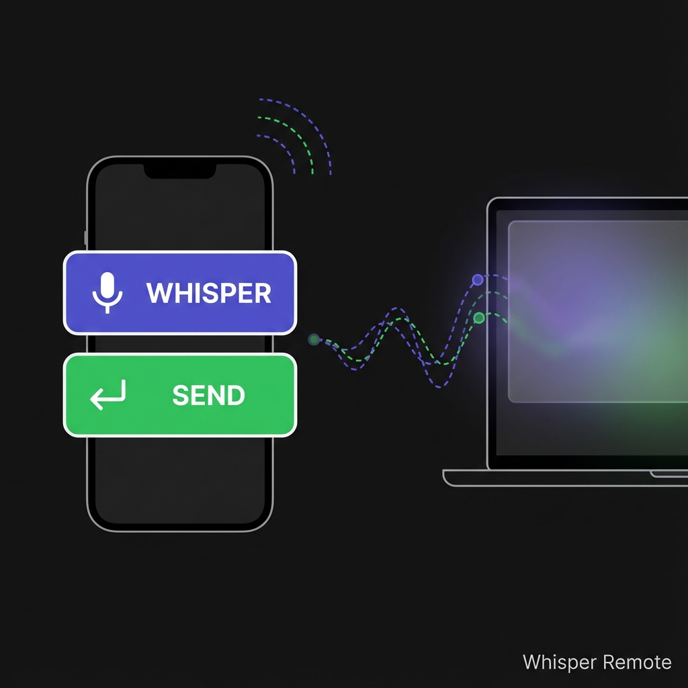

# Whisper Remote

[](https://securityscorecards.dev/viewer/?uri=github.com/vanzan01/whisper-remote)
[](https://www.bestpractices.dev/projects/11699)



A tiny Windows utility that lets you trigger Windows Whisper (voice typing) and press Enter from your phone.

## Why?

When working with AI assistants in voice mode, the best conversations happen when you're pacing around, thinking out loud - not sitting at your desk. But Windows Whisper needs `Ctrl+Win+Space` to start/stop, and you need `Enter` to send your message.

This tool puts those two buttons on your phone. Walk around, think, dictate your thoughts, and send - all without running back to your keyboard.

This is my workflow for using Claude Code - brainstorm out loud, dictate responses, and keep the conversation flowing without being tied to my desk.

## Quick Start

1. Download `whisper-remote.exe` from [Releases](../../releases)
2. Run it - Windows Firewall will ask for permission (click Allow - this lets your phone connect)
3. A QR code will appear
4. Scan the QR code with your phone
5. Tap the buttons to control your PC

## Features

- **Whisper Button** - Triggers `Ctrl+Win+Space` (Windows voice typing)
- **Send Button** - Presses `Enter` (submit your dictated text)
- **System Tray** - Runs quietly in the background
- **QR Code** - Easy phone connection, no typing URLs
- **No Install** - Single portable exe, no dependencies

## Configuration

```bash
# Change the port (default: 8080)
whisper-remote.exe -port 9000

# Change the hotkey (default: ctrl+win+space)
whisper-remote.exe -hotkey ctrl+shift+d

# Both
whisper-remote.exe -port 9000 -hotkey ctrl+alt+space
```

### Supported Hotkey Format

Modifiers: `ctrl`, `alt`, `shift`, `win`
Keys: `a-z`, `space`, `enter`, `tab`, `esc`

Examples:
- `ctrl+win+space` (default - Windows Whisper)
- `ctrl+shift+a`
- `alt+tab`
- `win+d`

## Requirements

- Windows 10/11
- Phone and PC on the same WiFi network

## Building from Source

```bash
go build -ldflags="-H=windowsgui" -o whisper-remote.exe .
```

## How It Works

The exe runs a small web server on your local network. Your phone connects to it and sends commands. The app simulates keyboard input using the Windows API.

Your phone and PC must be on the same network. Nothing is sent to the internet.

## Security

This is open source - the entire app is ~400 lines of Go in a single file. Read [main.go](main.go) yourself or build from source if you prefer.


## Future

This kind of functionality may eventually be built into tools like Wispr Flow. Until then, this works.

If you find it useful, leave a star or comment.

## License

MIT
